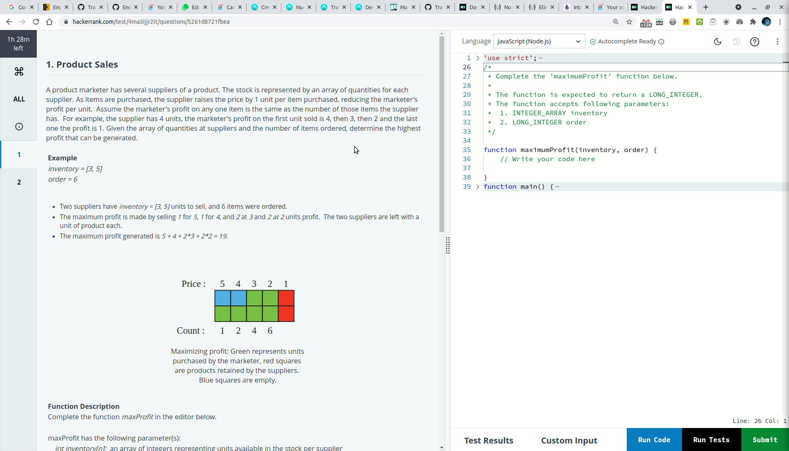
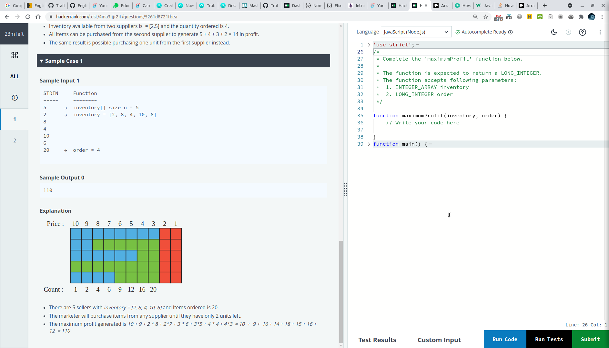

# Cálculo de máxima ganancia

- Un comercializador de productos tiene varios proveedores de un producto.

- El stock está representado por una matriz de cantidades para cada proveedor. A medida que se compran los artículos, el proveedor aumenta el precio en 1 unidad por artículo comprado, lo que reduce la ganancia por unidad del comercializador.

- Suponga que la ganancia del vendedor en cualquier artículo es la misma que la cantidad de esos artículos que tiene el proveedor.

- Por ejemplo, el proveedor tiene 4 unidades, la ganancia del vendedor en la primera unidad vendida es 4, luego 3, luego 2 y la última la ganancia es 1.

## Problema

- Dada la matriz de cantidades en los proveedores y el número de artículos pedidos, determine el mayor beneficio que se puede generar. 

## Solución

- Para cada proveedor se crea un array.
- Cada array tiene tantos elementos como es el precio máximo posible.
- Todos los arrays tendran igual longitud.
- Cada array se puebla con el precio que tendra el item a vender. El precio mínimo es 1 y se incrementa de a uno hasta alcanzar la cantidad de inventario disponible.
- Cuando se sobrepasa el inventario disponible completamos con "0"
- Luego invertimos los arrays.
- Lo que tendremos ahora será un array para cada proveedor en que cada elemento representa el precio de un item.
- Ejemplos:
```
proveedor con solo 2 items disponibles en inventario:   [0, 0, 0, 0, 0, 0, 0, 0, 2, 1]
proveedor con solo 8 items disponibles en inventario:   [0, 0, 8, 7, 6, 5, 4, 3, 2, 1]
proveedor con solo 4 items disponibles en inventario:   [0, 0, 0, 0, 0, 0, 4, 3, 2, 1]
proveedor con solo 10 items disponibles en inventario: [10, 9, 8, 7, 6, 5, 4, 3, 2, 1]
proveedor con solo 6 items disponibles en inventario:   [0, 0, 0, 0, 6, 5, 4, 3, 2, 1]
```
- Finalmente avanzamos de a un elemento en cada array y sumamos sus valores hasta completar la cantidad de items ordenados. 
```js
if (price > 0 && orderCompleted < order) {
    profit += price
    orderCompleted++
}  
```  
- En cuanto sobrepasemos la cantidad de items ordenados, la suma (profit) será la máxima ganancia y el problema habrá sido resuelto.

## Implementación


```js
function maximumProfit(inventory, order) {
  const suppliers = {}
  const maxPrice = Math.max(...inventory)

  inventory.forEach((element, index) => {
    const index2 = index
    if (!suppliers[`sup-${index2}`]) {
      suppliers[`sup-${index2}`] = {}
    }
    suppliers[`sup-${index2}`]["inventory"] = element
    suppliers[`sup-${index2}`]["boxes"] = []
  })

  const totales = []
  Object.keys(suppliers).forEach((obj, suppIndex) => {
    const supp = suppliers[obj]
    const inventory = supp["inventory"]
    const boxes = supp["boxes"]

    for (let index = 1; index <= maxPrice; index++) {
      if (index <= inventory) {
        suppliers[`sup-${suppIndex}`]["boxes"].push(index)
      } else {
        suppliers[`sup-${suppIndex}`]["boxes"].push(0)
      }
    }
  })

  Object.keys(suppliers).forEach((obj, suppIndex) => {
    const supp = suppliers[obj]
    suppliers[`sup-${suppIndex}`]["boxes"] = supp["boxes"].reverse()
  })

  let orderCompleted = 0
  let profit = 0
  for (let index = 0; index < maxPrice; index++) {
    Object.keys(suppliers).forEach((obj, suppIndex) => {
      const supp = suppliers[obj]
      const price = supp["boxes"][index]
      if (price > 0 && orderCompleted < order) {
        profit += price
        orderCompleted++
      }
    })
  }

  return profit
}
```

## Logs de ejecución de los tests

```js
// maximumProfit con [2, 8, 4, 10, 6] y order 20
{
  "sup-0": {
    inventory: 2,
    boxes: [0, 0, 0, 0, 0, 0, 0, 0, 2, 1],
  },
  "sup-1": {
    inventory: 8,
    boxes: [0, 0, 8, 7, 6, 5, 4, 3, 2, 1],
  },
  "sup-2": {
    inventory: 4,
    boxes: [0, 0, 0, 0, 0, 0, 4, 3, 2, 1],
  },
  "sup-3": {
    inventory: 10,
    boxes: [10, 9, 8, 7, 6, 5, 4, 3, 2, 1],
  },
  "sup-4": {
    inventory: 6,
    boxes: [0, 0, 0, 0, 6, 5, 4, 3, 2, 1],
  },
}

// maximumProfit con [3, 5] y order 6
const t2 = {
  "sup-0": { inventory: 3, boxes: [0, 0, 3, 2, 1] },
  "sup-1": { inventory: 5, boxes: [5, 4, 3, 2, 1] },
}

// maximumProfit con [2, 5] y order 4
const t3 = {
  "sup-0": { inventory: 2, boxes: [0, 0, 0, 2, 1] },
  "sup-1": { inventory: 5, boxes: [5, 4, 3, 2, 1] },
}
```

## Install
- npm i

## Test
- npm test

---

## Screenshots de problema original

- En los diagramas que aparecen en los screenshots ayuda a entender que la suma de los boxes verdes y rojos son el inventario disponiblede cada proveedor.
- El comercializador de productos empieza a adquirir (boxes verdes) desde izquierda a derecha la mayor cantidad (de cada proveedor) de items que le den mayor ganancia.
- Termina de comprar cuando la cantidad de boxes verdes es la que necesitaba




